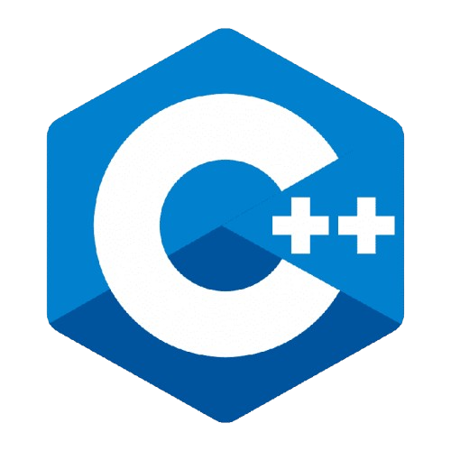
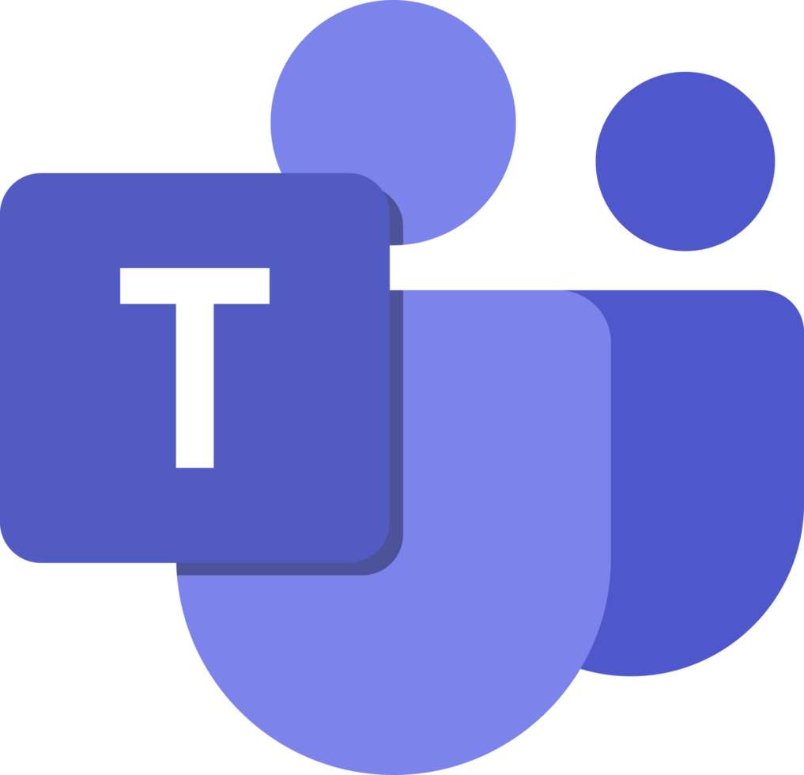

  <h1>IDSM Finances</h1>
  

## About Us
IDSM Finances was created by a team passionate about helping people manage their money with ease. Our goal is to simplify tracking your finances, so you can see where your money goes and make better financial choices every day.

## 🚀 Languages Used

  

## 🔧 Used Tools

 
  
  
  
  
  
  

## 📄 Documents
### Documentation
[Documentation](files/Documentation.docx)

### Presentation    
[Presentation](files/IDSM-Presentation.pptx)

## Our Team
- <a href="https://github.com/SBIvanov22">Stefan Ivanov</a> -> Backend Developer 🟨 10A
- <a href="https://github.com/MPNedelchev22">Milan Nedelchev</a> -> SCRUM Trainer 🟦 10G
- <a href="https://github.com/ISStanchev22">Iliyan Stanchev</a> -> Backend Developer 🟦 10G
- <a href="https://github.com/DYKartalova22">Dariya Kartalova</a> -> Backend Developer 🟦 10G

