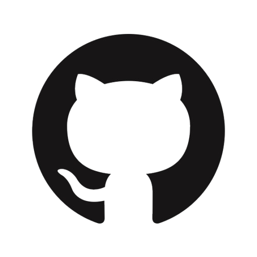

# Team IDSM Finances

## 🗂️ Used technologies
 
 
    
    
      
      
      
    
 

## 📄 Documents
### Documentation
  [Documentation]()
### Presentation
[Presentation]()

## Our Team 
- <a href = "https://github.com/SBIvanov22"> Stefan Ivanov </a> -> Backend Developer 🟨 10A
- <a href = "https://github.com/MPNedelchev22"> Milan Nedelchev </a> -> SCRUM Trainer 🟦 10G
- <a href = "https://github.com/ISStanchev22"> Iliyan Stanchev </a> ->  Backend Developer 🟦 10G
- <a href = "https://github.com/DYKartalova22"> Dariya Kartalova </a> ->  Backend Developer🟦 10G